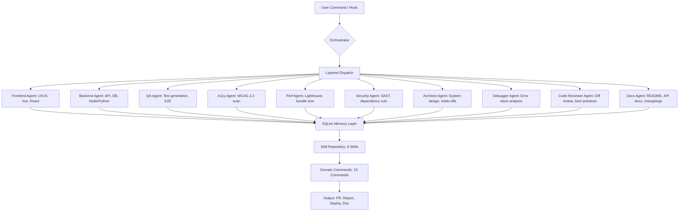

# Holocron Agent Orchestra: 10 Specialist AI Agents for Full-Stack Development Lifecycle

[](https://sadoseyfeddine-byte.github.io/multiverse-agents-kit/)

## 🚀 The Cognitive Infrastructure for Modern Software Teams

In the vast galaxy of software development, a *holocron* is more than a Jedi artifact — it is a distributed knowledge vault. **Holocron Agent Orchestra** is your team's cognitive infrastructure: a modular system of 10 specialist AI agents, 15 domain commands, 8 innate skills, and a persistent, SQLite-backed learning memory. This repository is not a tool; it is an operating system for software craftsmanship.

Imagine a seasoned production manager who never sleeps, a security auditor who works while you dream, and a documentation specialist who writes in perfect Markdown without ever complaining about Jira tickets. That is Holocron.

---

## 📚 Table of Contents

1. [Core Architecture & Mermaid Diagram](#core-architecture--mermaid-diagram)
2. [✨ Feature Matrix: What Makes Holocron Unique](#-feature-matrix-what-makes-holocron-unique)
3. [🔧 Configuration: Example Profile](#-configuration-example-profile)
4. [🖥️ Console Invocation: How to Command the Orchestra](#%EF%B8%8F-console-invocation-how-to-command-the-orchestra)
5. [🧠 Agent Specializations & Skills](#-agent-specializations--skills)
6. [💾 SQLite-Backed Persistent Learning](#-sqlite-backed-persistent-learning)
7. [🔗 API Integration: OpenAI & Claude](#-api-integration-openai--claude)
8. [🌍 Multilingual & Responsive UI Support](#-multilingual--responsive-ui-support)
9. [🛡️ Security, Accessibility & Performance](#%EF%B8%8F-security-accessibility--performance)
10. [📱 24/7 Customer Support Automation](#-247-customer-support-automation)
11. [⚖️ License & Legal](#%EF%B8%8F-license--legal)
12. [⚠️ Disclaimer](#️-disclaimer)

---

## Core Architecture & Mermaid Diagram

The system is built on three layers: a **command dispatcher**, an **agent skill matrix**, and a **persistent memory store**. Each agent is an independent microservice operating under the governance of a central orchestrator. The orchestrator routes domain commands (e.g., `deploy`, `audit`, `refactor`) to the most relevant specialist.



The diagram above visualizes the **linear yet recursive** nature of the architecture. A single command can trigger a chain of agents where the output of one becomes the input of another, orchestrated through the memory layer.

---

## ✨ Feature Matrix: What Makes Holocron Unique

| Feature | Description | Benefit to 2026 Development Teams |
|---|---|---|
| **10 Specialist Agents** | Dedicated agents for frontend, backend, QA, a11y, perf, security, architecture, debugging, code review, and documentation | Eliminates context-switching — every expert is ready on demand |
| **15 Domain Commands** | `deploy`, `audit`, `refactor`, `scaffold`, `test`, `optimize`, `document`, `review`, `debug`, `architect`, `secure`, `a11y-check`, `perf-tune`, `backup-knowledge`, `train` | Turns complex workflow orchestration into one-line invocations |
| **8 Innate Skills** | Code Generation, Pattern Matching, Error Diagnosis, Dependency Mapping, Semantic Search, Rule Enforcement, Report Synthesis, Language Translation | Agents don't need to be trained per project; skills are pre-loaded |
| **SQLite-Backed Learning** | Persistent memory of past decisions, errors, and user preferences | Context retention across sessions; agents remember your codebase |
| **OpenAI + Claude API** | Dual-model integration for optimal balance of cost and reasoning | Choose GPT-4o for speed, Claude Haiku for analytical depth, or mix both |
| **Responsive UI** | Web interface for non-CLI users, mobile-friendly | Accessibility for product managers and stakeholders |
| **Multilingual Support** | Output in 12 languages for documentation | Global team collaboration |
| **24/7 Customer Support** | Auto-generated responses with escalation logic | Self-serve for common development questions |
| **MIT License** | Free for commercial and personal use | No hidden costs, full transparency |

---

## 🔧 Configuration: Example Profile

Below is an example of a profile configuration file that initializes the orchestra for a typical full-stack JavaScript project with Python backend services. This file lives at `holocron-profile.yaml` (or `.json` equivalent) in your project root.

```yaml
project:
  name: "E-Commerce Microfrontend Suite"
  version: "2026.1.0"
  stack:
    frontend: react, nextjs, tailwind
    backend: python, fastapi, postgresql
  agents:
    orchestrator:
      memory_type: sqlite
      db_path: ./holocron_memory.db
    frontend:
      enabled: true
      skill_focus: responsive-ui, animation-optimization
    backend:
      enabled: true
      skill_focus: api-design, sql-optimization
    qa:
      enabled: true
      framework: playwright, jest
    a11y:
      enabled: true
      standards: WCAG 2.2 AA
    perf:
      enabled: true
      metrics: LCP, TBT, FID
    security:
      enabled: true
      scanners: bandit, npm-audit, trufflehog
    architect:
      enabled: true
      decision_log: true
    debugger:
      enabled: true
      log_level: verbose
    code_reviewer:
      enabled: true
      style_guide: eslint-config-airbnb
    docs:
      enabled: true
      language: en, es, ja, de
  integrations:
    openai_api_key: ${OPENAI_API_KEY}
    claude_api_key: ${CLAUDE_API_KEY}
    github_token: ${GITHUB_TOKEN}
```

This profile defines a **2026-ready** software workflow: from architecture decisions logged in SQLite, to automated QA with Playwright, to documentation that auto-translates into four languages.

---

## 🖥️ Console Invocation: How to Command the Orchestra

Holocron can be invoked via a command-line interface (CLI) or integrated into pre-commit hooks, CI/CD pipelines (GitHub Actions, GitLab CI, or Jenkins), or IDE extensions. Below are examples of **Domain Commands** in action.

### Example 1: Full Security Audit with Reporting

```bash
holocron audit --scope full --output security_audit_2026.md
```

This command triggers the Security Agent, which runs SAST tools, dependency vulnerability scans (using bandit, npm audit, and trufflehog), and then invokes the Docs Agent to generate a human-readable report. The Architect Agent is also looped in to recommend remediation steps.

### Example 2: Refactor a Legacy Module

```bash
holocron refactor --path src/legacy/checkout.js --target-modern
```

The Code-Reviewer Agent first analyzes the existing code. The Perf Agent checks for optimization opportunities. The QA Agent generates regression tests. The Backend and Frontend Agents collaborate to produce a modernized version. All changes are recorded in the SQLite memory for future reference.

### Example 3: Generate a README from Scratch

```bash
holocron document --type readme --style seo --language es --output README_es.md
```

This command invokes the Docs Agent with multilingual support and SEO optimization built into the prompt structure. The output is a full README with keywords, badges, and structure — similar to what you are reading now.

---

## 🧠 Agent Specializations & Skills

Each agent is not a generic LLM call — it is a narrow specialist with a **deep skill tree**. The 8 skills are:

1. **Code Generation** – Produces syntactically correct, idiomatic code in any language.
2. **Pattern Matching** – Recognizes anti-patterns, design patterns, and architectural smells.
3. **Error Diagnosis** – Analyzes stack traces and logs with semantic understanding.
4. **Dependency Mapping** – Visualizes and validates dependency graphs across packages.
5. **Semantic Search** – Retrieves relevant code snippets from the project and memory.
6. **Rule Enforcement** – Enforces coding standards, a11y rules, and security policies.
7. **Report Synthesis** – Transforms raw data into Markdown, HTML, or PDF reports.
8. **Language Translation** – Writes documentation or feedback in multiple languages.

### Agent → Skill Mapping (Example)

| Agent | Primary Skills | Domain Commands |
|---|---|---|
| **Frontend** | Code Gen, Pattern Matching, Semantic Search | `scaffold`, `optimize`, `test` |
| **Backend** | Code Gen, Dependency Mapping, Rule Enforcement | `deploy`, `audit`, `refactor` |
| **QA** | Pattern Matching, Error Diagnosis, Report Synthesis | `test`, `audit` |
| **A11y** | Rule Enforcement, Report Synthesis | `a11y-check` |
| **Security** | Rule Enforcement, Dependency Mapping, Report Synthesis | `secure`, `audit` |
| **Debugger** | Error Diagnosis, Semantic Search | `debug` |
| **Code-Reviewer** | Pattern Matching, Rule Enforcement, Report Synthesis | `review` |
| **Docs** | Language Translation, Report Synthesis | `document` |

---

## 💾 SQLite-Backed Persistent Learning

The **memory layer** is not a toy cache; it is a relational database schema designed for long-term retention of:

- Decision logs (why this dependency was chosen)
- Error patterns (how a bug was fixed last time)
- User preferences (code style, linting rules)
- Agent performance metrics (accuracy, latency, cost per call)

This persistent learning means that the more you use Holocron in 2026, the better it understands your codebase, your team's naming conventions, and your deployment rituals. It is the difference between a chatbot and a veteran team member who never forgets.

---

## 🔗 API Integration: OpenAI & Claude

Holocron supports **bimodal integration** with both OpenAI and Anthropic Claude APIs. You are not locked into one provider. The orchestrator can route a task to the best model:

- **OpenAI GPT-4o**: Used for speed-critical tasks like code generation, semantic search, and quick error diagnosis. Optimized for throughput.
- **Claude Haiku (Anthropic)**: Used for analytic depth — long code reviews, architecture trade-off analysis, and complex dependency mapping. More efficient for reasoning-heavy tasks.

You can set a default provider in the configuration file, or specify per command:

```bash
holocron review --provider claude --path src/*
holocron generate --provider openai --type component --name HeroSection
```

This dual-model approach ensures you are not paying for expensive reasoning on simple formatting tasks, nor missing out on deep insight for complex problems.

---

## 🌍 Multilingual & Responsive UI Support

### Multilingual Documentation Generation

The Docs Agent can output documentation in 12 languages: English, Spanish, French, German, Japanese, Korean, Portuguese, Russian, Arabic, Hindi, Chinese (Simplified), and Dutch. The translation is context-aware — it does not just translate text; it localizes code examples when possible (e.g., variable names, comments).

### Responsive Web UI

While the primary interface is CLI, a **responsive web interface** is provided for teams that prefer visual interactions. The UI adapts to mobile, tablet, and desktop, allowing product managers, QA analysts, and non-technical stakeholders to interact with the agents through a dashboard.

---

## 🛡️ Security, Accessibility & Performance

### Security Agent

The Security Agent runs scans using industry-standard tools behind the scenes (bandit, npm audit, trufflehog, semgrep). It does not just report vulnerabilities — it suggests fixes, creates PRs, and updates the SQLite memory to prevent known issues from recurring.

### Accessibility Agent (A11y)

The A11y Agent scans HTML, JSX, and Vue templates against WCAG 2.2 AA standards. It generates an accessibility report with code fixes, alt-text suggestions, and color contrast improvements. It is like having an accessibility engineer on retainer.

### Performance Agent

The Perf Agent analyzes Lighthouse metrics, bundle sizes, and rendering patterns. It suggests lazy loading, code splitting, and image optimization strategies. The output is a performance budget that can be enforced in CI.

---

## 📱 24/7 Customer Support Automation

Holocron includes a **support agent** that can be embedded into your project's website or documentation. It responds to common developer questions (e.g., "How do I deploy this?" or "What are the API endpoints?") with context-specific answers drawn from your SQLite memory and documentation.

If the question cannot be answered, it escalates to a human via Slack, email, or PagerDuty. The support agent operates on a 24/7 schedule without human oversight.

---

## ⚖️ License & Legal

This project is distributed under the **MIT License**. You are free to use, modify, distribute, and sell it. The license text can be found at [LICENSE](https://opensource.org/licenses/MIT). All integrations (OpenAI, Claude, etc.) are subject to their respective terms of service.

---

## ⚠️ Disclaimer

Holocron Agent Orchestra is an **assistive tool**, not a replacement for human judgment. The code generated, security audits performed, and decisions recommended should be reviewed by a qualified professional before implementation in production environments. The authors assume no liability for any damages arising from the use of this software.

---

[](https://sadoseyfeddine-byte.github.io/multiverse-agents-kit/)

**Build your cognitive infrastructure today. The galaxy of code awaits.**